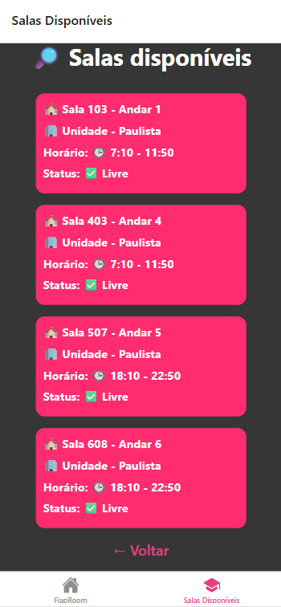
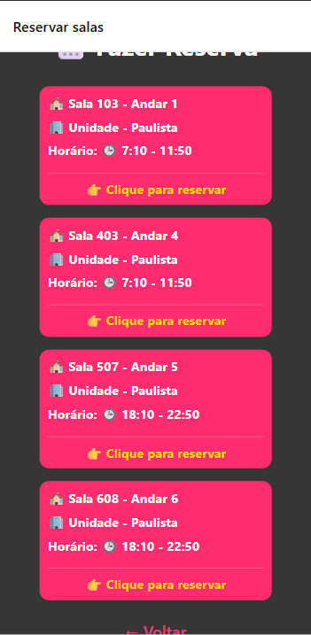

# FiapRoom App

## 📌 Sobre o Projeto

**FiapRoom:** O FiapRoom é um aplicativo desenvolvido para ajudar os estudantes da FIAP a descobrir de maneira fácil e ágil quais salas estão livres para estudos.


**Operação FIAP Escolhida:** A operação da FIAP escolhida foi a de consulta de salas vazias, principalmente por ser algo que afeta diariamente inúmeros alunos da faculdade que buscam salas livres para estudar e realizar suas atividades. Atualmente, essa solução ainda não foi implementada nos sites e aplicativos da FIAP, o que torna o app um  recurso eficiente, permitindo que os estudantes consultem a disponibilidade de salas em poucos segundos, sem precisar perguntar diretamente para nenhum funcionário.


**Funcionalidades Implementadas:**
* **Tela Home**: Tela inicial do app, com botões de navegação para as telas de verificação de salas livres e de reserva de salas disponíveis.

* **Tela de Salas**: Tela de visualização das salas disponíveis organizadas dentro de cards com as informações do número e andar da sala, unidade, horário e o status.

* **Tela de Reserva**: Tela com um botão de reserva, que permite aos usuários reservarem uma sala que esteja disponível naquele momento.

* **Botão de voltar**: botão que permite ao usuário retornar para a tela inicial do aplicativo.


---

## 👥 Integrantes do Grupo

* **Giovanni de Lela** — RM: 563066
* **Gabriel Nakamura** — RM: 562221
* **Gisleine** — RM: 563804

---

## 🚀 Como Rodar o Projeto

### Pré-requisitos
Certifique-se de ter as seguintes ferramentas instaladas na sua máquina:
* [Node.js](https://nodejs.org/en/) (versão X.X ou superior)
* [Expo CLI](https://docs.expo.dev/get-started/installation/) (`npm install -g expo-cli`)
* Aplicativo **Expo Go** instalado no seu smartphone (Android ou iOS) ou um emulador configurado.

### Passo a Passo

1. **Clone o repositório:**
   ```bash
   git clone [URL_DO_SEU_REPOSITORIO]
2. **Acesse a pasta do projeto**
    ```bash
    cd [NOME_DA_PASTA_DO_PROJETO]
3. **Instale as dependências:**
    ```bash
    npm install
    # ou
    yarn install
4. **Inicie o servidor de desenvolvimento:**
    ```bash
    npx expo start
5. **Execute no dispositivo:**

Escaneie o QR Code que aparecerá no terminal usando o aplicativo Expo Go no seu celular.

Ou pressione a no terminal para abrir no emulador Android, ou i para o simulador iOS.

# 🛠️ Decisões Técnicas
## Estrutura do Projeto

O projeto foi desenvolvido utilizando React Native com Expo, com uma estrutura baseada em componentização. As responsabilidades foram separadas entre telas (screens) e componentes reutilizáveis (components), facilitando a organização do código e a manutenção. O arquivo App.js atua como ponto de entrada da aplicação.

## Hooks Utilizados

useState: Utilizado para gerenciar estados locais das telas, como dados exibidos e interações do usuário.

useEffect: Utilizado para executar efeitos colaterais, como carregamento inicial de dados ao abrir a tela.

## Navegação

A navegação foi estruturada utilizando biblioteca de navegação (ex: React Navigation), permitindo a transição entre diferentes telas do aplicativo.

Organização baseada em rotas

Separação clara entre telas

Navegação fluida entre funcionalidades

## Screenshots






